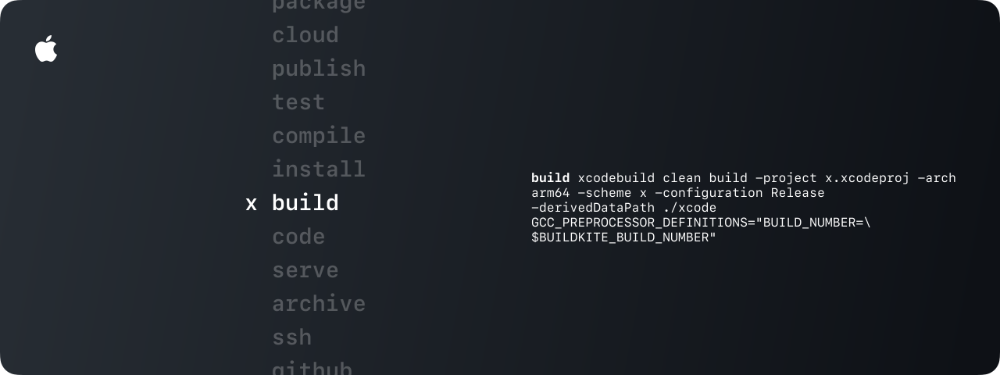

**x is a macOS command line tool for running development tasks.** Create an `x.json5` file in your project to:

- `install` libraries and frameworks
- `start` servers and run `tests`
- `build` and `deploy` apps, or
- `zxcvbnm` ...

## Usage

> [!NOTE]
> x is built for the latest release of macOS.

### Install

You can download all pre-compiled binaries from the [GitHub Releases](https://github.com/bimo2/x/releases) section or run the install script out of the box:

```sh
curl -sf https://raw.githubusercontent.com/bimo2/x/main/install | sh
```

### TLDR

```sh
x
```

## DEBUG

Use `x` to build x. Production binaries are built with CI (Buildkite) and should downloaded and renamed to `x-macos-$(VERSION)` (ex. `x-macos-0.1`).

```sh
# build the debug scheme
x build

# test the debug binary
./xcode/Build/Products/Debug/x

# test the install script
curl -sf file://$(pwd)/install | sh
```

#

<sub><sup>**MIT.** Copyright &copy; 2024 Bimal Bhagrath</sup></sub>
